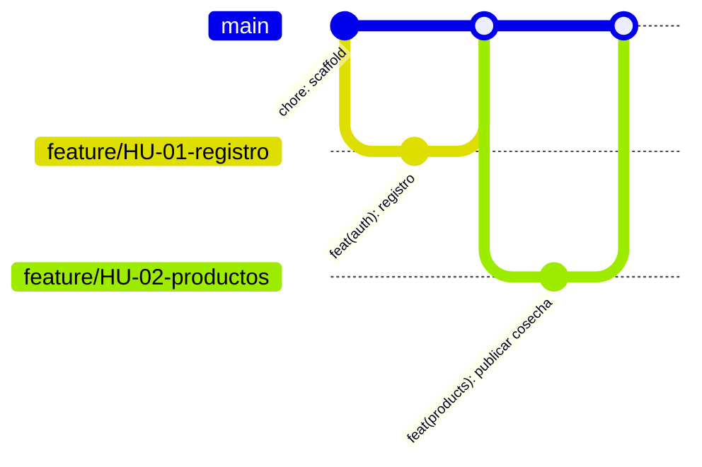

# AgroValle Connect


Plataforma web empresarial para conectar directamente la oferta agricola de las fincas del Valle del Cauca con la demanda comercial urbana de Cali y sus alrededores.

## Vision del producto

Para **productores del Valle**, que **necesitan vender directo**, AgroValle Connect es una **plataforma web en Java**, que **conecta oferta y demanda a precio justo**. A diferencia de los **intermediarios tradicionales**, nuestro producto **garantiza trazabilidad y contratos de API transparentes**.

## Integrantes

- Danny Alexander Gomez
- Michelle Guerrero Arboleda
- Starlin Gomez Asprilla
- Raul Santiago Carrillo

## Sprint 0

El Sprint 0 establece una base mantenible y verificable: Java 17, Spring Boot, Maven, Checkstyle basado en Google Java Style, pruebas JUnit 5, hooks de Husky y automatizacion de CI. La logica del dominio se desarrollara en ramas cortas por historia de usuario.

## Estrategia de ramas

Se adopta **Trunk-Based Development**: `main` permanece protegida y estable; cada historia se desarrolla en una rama `feature/HU-XX-descripcion` de corta duracion. Todo cambio llega a `main` por Pull Request con una aprobacion de un integrante. Esta estrategia reduce conflictos por integraciones tardias y permite integrar y validar continuamente.



## Inicio rapido

```bash
mvn clean verify
npm install
```

Husky ejecuta `mvn test` y `mvn checkstyle:check` antes de cada commit. Si un equipo no puede instalar Husky, debe correr `mvn clean verify` antes de abrir el Pull Request.

## Normas de colaboracion

1. Actualiza `main` antes de iniciar: `git pull origin main`.
2. Crea una rama por tarea: `git switch -c feature/HU-XX-descripcion`.
3. Usa Conventional Commits: `feat:`, `fix:`, `docs:`, `test:`, `chore:`.
4. Abre un Pull Request, relaciona la HU, adjunta resultados de pruebas y solicita revision cruzada.
5. Solo se fusiona despues de una aprobacion y CI exitoso.

## Documentacion

- [Product Backlog](BACKLOG.md)
- [Definition of Done](docs/dod.md)
- [Decision de arquitectura](docs/adr/001-arquitectura-inicial.md)
- [Guia de Pull Request](.github/pull_request_template.md)

