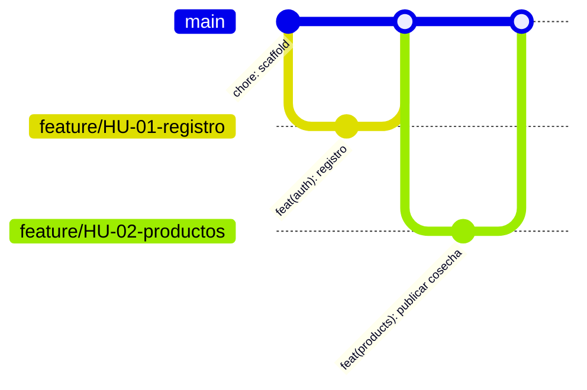

# AgroValle Connect


Plataforma web empresarial para conectar directamente la oferta agricola de las fincas del Valle del Cauca con la demanda comercial urbana de Cali y sus alrededores.

## Vision del producto

Para **productores del Valle**, que **necesitan vender directo**, AgroValle Connect es una **plataforma web en Java**, que **conecta oferta y demanda a precio justo**. A diferencia de los **intermediarios tradicionales**, nuestro producto **garantiza trazabilidad y contratos de API transparentes**.

## Integrantes y roles

| Integrante | Rol Scrum / responsabilidad | Estado |
|---|---|---|
| Danny Alexander Gomez | Scrum Master / facilitación del equipo | Asignado |
| Michelle Guerrero Arboleda | Product Owner / gestión del Product Backlog | Asignado |
| Starlin Gomez Asprilla | Developer / pruebas y calidad | Asignado |
| Raul Santiago Carrillo | Developer / desarrollo backend | Asignado |

## Sprint 0

El Sprint 0 establece una base mantenible y verificable: Java 17, Spring Boot, Maven, Checkstyle basado en Google Java Style, pruebas JUnit 5, hooks de Husky y automatizacion de CI. La logica del dominio se desarrollara en ramas cortas por historia de usuario.

## Estrategia de ramas

Se adopta **Trunk-Based Development**: `main` se mantiene estable; cada historia se desarrolla en una rama `feature/HU-XX-descripcion` de corta duracion. Todo cambio llega a `main` por Pull Request con una aprobacion de un integrante. Esta estrategia reduce conflictos por integraciones tardias y permite integrar y validar continuamente. El estado real de la regla de proteccion se verifica en GitHub; hasta que aparezca activa, no se afirma que `main` este protegida.


```mermaid
gitGraph
   commit id: "chore: scaffold"
   branch feature/HU-01-registro
   checkout feature/HU-01-registro
   commit id: "feat(auth): registro"
   checkout main
   merge feature/HU-01-registro
   branch feature/HU-02-productos
   checkout feature/HU-02-productos
   commit id: "feat(products): publicar cosecha"
   checkout main
   merge feature/HU-02-productos
```

## Inicio rapido

Se requiere Java 17, Maven, Node.js/npm y Docker Compose para levantar la base PostgreSQL local.

```bash
docker compose up -d db
mvn clean verify
npm install
```

La aplicacion usa PostgreSQL en `localhost:5432` por defecto. Para otros entornos configura `DB_URL`, `DB_USERNAME` y `DB_PASSWORD`; los valores de desarrollo incluidos no deben usarse en produccion. Para cargar datos de demostracion del catalogo, ejecuta `psql -h localhost -U agrovalle -d agrovalle_connect -f scripts/sprint-1-demo-data.sql`.

El incremento del primer corte es una API backend; la interfaz web, pedidos, stock y logistica quedan para incrementos posteriores. Los diagramas UML iniciales se encuentran en [docs/uml](docs/uml/README.md). El despliegue a staging queda preparado para un webhook del proveedor; su activacion requiere configurar el secreto `STAGING_DEPLOY_HOOK` segun [docs/deploy-staging.md](docs/deploy-staging.md).

Por defecto, las pruebas automatizadas locales usan H2 en modo compatible con PostgreSQL. GitHub Actions levanta PostgreSQL 16 y ejecuta las mismas pruebas contra el motor requerido.

Husky ejecuta `mvn test` y `mvn checkstyle:check` antes de cada commit. Si un equipo no puede instalar Husky, debe correr `mvn clean verify` antes de abrir el Pull Request.

## Normas de colaboracion

1. Actualiza `main` antes de iniciar: `git pull origin main`.
2. Crea una rama por tarea: `git switch -c feature/HU-XX-descripcion`.
3. Usa Conventional Commits: `feat:`, `fix:`, `docs:`, `test:`, `chore:`.
4. Abre un Pull Request, relaciona la HU, adjunta resultados de pruebas y solicita revision cruzada.
5. Solo se fusiona despues de una aprobacion y CI exitoso.

## Documentacion

- [Product Backlog](BACKLOG.md)
- [Definition of Done](docs/dod.md)
- [Planificacion del Sprint 1](docs/sprint-1-planning.md)
- [Bitacora Daily Scrum](docs/bitacora-daily-scrum.md)
- [Sprint Review](docs/sprint-1-review.md)
- [Retrospectiva Sprint 1](docs/sprint-1-retrospective.md)
- [Contratos REST y guia de demo](docs/api-sprint-1.md)
- [Coleccion de Postman Sprint 1](docs/postman/agrovalle-sprint-1.postman_collection.json)
- [Datos de demostracion del catalogo](scripts/sprint-1-demo-data.sql)
- [Decision de arquitectura](docs/adr/001-arquitectura-inicial.md)
- [Diagramas UML evolutivos](docs/uml/README.md)
- [Despliegue a staging](docs/deploy-staging.md)
- [Guia de Pull Request](.github/pull_request_template.md)

