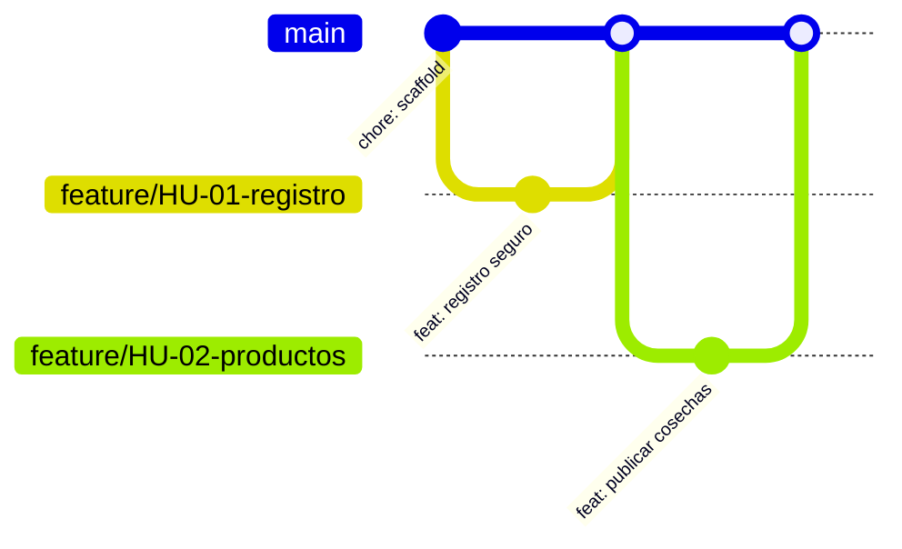

# AgroValle Connect

AgroValle Connect es una aplicación web para conectar a pequeños y medianos agricultores del Valle del Cauca con compradores, restaurantes y comercios de Cali. Publica cosechas con cantidad, precio y fecha, facilita contacto y reservas, y conserva el avance logístico.

## Visión del producto

Para pequeños y medianos productores del Valle del Cauca que necesitan vender sus cosechas directamente, AgroValle Connect es una plataforma web de comercio agrícola que conecta su oferta con comerciantes y restaurantes de Cali y la región. A diferencia de la venta mediante cadenas largas de intermediarios, ofrece catálogo por municipio, contacto directo y coordinación de reservas y entregas.

## Enlaces del proyecto

- Repositorio: [santixit/agrovalle-connect](https://github.com/santixit/agrovalle-connect)
- Tablero Kanban: [Agrovalle-Kamba](https://github.com/users/santixit/projects/3/views/1)
## Integrantes y roles

| Integrante | Rol Scrum / responsabilidad |
|---|---|
| Danny Alexander Gomez | Scrum Master / facilitación |
| Michelle Guerrero Arboleda | Product Owner / Product Backlog |
| Starlin Gomez Asprilla | Developer / pruebas y calidad |
| Raul Santiago Carrillo Hernandez | Developer / desarrollo backend |

## Estado funcional

El repositorio conserva la base inicial de Sprint 0 y añade los flujos del integrador. El alcance actual incluye registro e inicio de sesión con JWT, catálogo y filtros, publicación de ofertas, consulta de precios a partir de entregas registradas, fincas, contactos con notificación, reservas con control transaccional de inventario, estados, despachos, trazabilidad, favoritos y reporte administrativo. La web de demostración se sirve desde Spring Boot en `/`.

El rol `ADMIN` se asigna mediante aprovisionamiento controlado de la cuenta, nunca por registro público. Las reuniones, revisiones por compañeros, decisiones del equipo y despliegue real deben documentarse con evidencia ocurrida; el repositorio no las inventa.

## Tecnologías y arquitectura

- Java 17 y Spring Boot 3.3.4; Maven.
- PostgreSQL y Flyway; H2 se usa en la suite local.
- HTML, CSS y JavaScript sin dependencias externas para la interfaz de demostración.
- JUnit 5, JaCoCo (mínimo de línea 60%) y Checkstyle.
- GitHub Actions ejecuta compilación, migraciones, pruebas, Checkstyle y cobertura; la base del job de CI es PostgreSQL 16.

El backend se organiza en `controller → service → repository → domain`, con DTOs validados y un manejador REST centralizado de errores. Flyway es la única fuente de evolución del esquema. Las migraciones ya aplicadas no se editan: cada cambio nuevo se agrega como `Vn__descripcion.sql`.

## Historias implementadas

| HU | Flujo | Estado |
|---|---|---|
| HU-01 | Registro de agricultores | Implementada; correo y contraseña opcionales en perfiles heredados, requeridos para acceso JWT |
| HU-02 | Publicación autenticada de cosechas | Implementada para rol `AGRICULTOR` |
| HU-03 | Promedio de precios recientes | Implementada con hasta 50 transacciones completadas por categoría en las últimas 24 horas; sin ventas muestra promedio nulo |
| HU-04 | Filtro de catálogo por municipio/categoría | Implementada |
| HU-05 | Contacto del comprador y aviso al agricultor | Implementada |
| HU-06 | Registro de finca y asociación a oferta | Implementada |
| HU-07 | Consulta del perfil del agricultor | Implementada; devuelve datos públicos del perfil asociado al identificador |
| HU-08 | Carrito, reservas y reducción segura de inventario | Implementada; consolida productos repetidos y crea un pedido por agricultor en una transacción con bloqueo de filas |
| HU-09 | Cambio de estado de una oferta propia | Implementada para `AGRICULTOR` |
| HU-10 | Detalle público de oferta | Implementada sin exponer cédula ni credenciales |
| HU-11 | Notificación por contacto y cambios del pedido | Implementada mediante eventos transaccionales |
| HU-12 | Preparación, programación y salida a ruta | Implementada con eventos visibles para seguimiento del pedido |
| HU-13 | Consulta cronológica de trazabilidad | Implementada para el comprador dueño del pedido |
| HU-14 | Favoritos del comprador | Implementada |
| HU-15 | Reporte de actividad por fechas | Implementada y restringida a `ADMIN` |

La definición oficial de HU-07 para el Primer Corte es la consulta del perfil del agricultor; así se conserva en `BACKLOG.md` y en la planificación del Sprint 1. El registro de compradores es una capacidad adicional del software y no sustituye esa historia.

## Preparar el entorno

Requisitos: JDK 17, Git y Docker Compose, o un PostgreSQL 16+ local. Para iniciar PostgreSQL incluido con Docker Compose y la configuración predeterminada del proyecto:

```powershell
docker compose up -d db
.\scripts\run-local.ps1
```

El script solicita la contraseña sin guardarla en el repositorio y genera un secreto JWT temporal para esa ejecución. Para usar otra instancia PostgreSQL local, pasa su URL y usuario. Ejemplo con una base cuyo nombre contiene un espacio:

```powershell
.\scripts\run-local.ps1 -DbUrl 'jdbc:postgresql://localhost:5432/agrovalle%20conect' -DbUsername 'postgres'
```

Si prefieres iniciar Spring Boot manualmente, define la conexión y genera un secreto Base64 válido en PowerShell:

```powershell
$env:DB_URL = 'jdbc:postgresql://localhost:5432/agrovalle_connect'
$env:DB_USERNAME = 'agrovalle'
$env:DB_PASSWORD = Read-Host 'Contraseña de PostgreSQL'
$bytes = New-Object byte[] 32
$rng = [System.Security.Cryptography.RandomNumberGenerator]::Create()
try {
  $rng.GetBytes($bytes)
  $env:JWT_SECRET = [Convert]::ToBase64String($bytes)
} finally {
  $rng.Dispose()
}
.\mvnw.cmd spring-boot:run
```

Abre `http://localhost:8080/`. Las migraciones Flyway crean y validan el esquema al iniciar. Detén la aplicación con `Ctrl+C`. En producción, el secreto JWT y las credenciales de la base se deben administrar como secretos del proveedor; no se deben copiar al repositorio.
## Pruebas y calidad

```powershell
.\mvnw.cmd clean verify
```

El comando compila con `--release 17`, ejecuta JUnit 5, Flyway sobre H2 local, Checkstyle y la regla JaCoCo. El informe HTML queda en `target/site/jacoco/index.html`. GitHub Actions usa el perfil `ci` y PostgreSQL para validar el motor objetivo.

## API principal

Los endpoints usan `/api/v1` y JSON. Los roles se asignan en JWT: `AGRICULTOR`, `COMPRADOR` y `ADMIN`.

| Método | Ruta | Acceso |
|---|---|---|
| POST | `/auth/register` | Público; crea perfil de agricultor y, si se envían ambos, cuenta JWT |
| POST | `/auth/register/comprador` | Público |
| POST | `/auth/login` | Público; devuelve Bearer JWT |
| GET | `/productores/{id}` | Público; datos de perfil no sensibles |
| GET | `/productos?municipio=Dagua&categoria=Frutas` | Público |
| GET | `/productos/{id}` | Público |
| POST | `/productos` | Agricultor |
| POST / GET | `/fincas` | Agricultor |
| PATCH | `/productos/{id}/estado` | Dueño agricultor |
| GET | `/precios/regionales?categoria=Frutas` | Público; últimas 50 ventas completadas de las últimas 24 horas |
| POST | `/contactos` | Comprador |
| POST | `/reservas` | Comprador |
| POST | `/reservas/carrito` | Comprador; consolida los artículos y agrupa pedidos por agricultor |
| POST | `/reservas/{id}/confirmar` | Agricultor dueño de las ofertas |
| POST | `/reservas/{id}/preparar` | Agricultor dueño; registra inicio de alistamiento |
| POST | `/despachos` | Agricultor dueño de la reserva confirmada |
| PATCH | `/despachos/{pedidoId}/en-ruta` | Agricultor dueño; registra salida y notifica al comprador |
| PATCH | `/despachos/{pedidoId}/entregado` | Agricultor dueño; registra transacciones de precio |
| GET | `/reservas/{id}/trazabilidad` | Comprador propietario |
| GET / POST / DELETE | `/favoritos` y `/favoritos/{productoId}` | Comprador |
| GET | `/notificaciones/mias` | Cuenta autenticada |
| GET | `/admin/reportes/actividad?desde=AAAA-MM-DD&hasta=AAAA-MM-DD` | Admin |

Errores usan códigos HTTP: validación 400, autenticación 401, autorización 403, no encontrado 404 y conflictos de duplicidad/inventario/estado 409. Las contraseñas se guardan con BCrypt. La interfaz mantiene el token solo en memoria de la pestaña.

## Patrones y decisiones

- **Repository:** repositorios Spring Data aíslan consultas JPA y la persistencia PostgreSQL.
- **Factory:** `UsuarioFactory` crea credenciales con hash y rol consistente según la clase de cuenta.
- **Observer:** eventos de contacto y cambio de pedido se publican tras completar la transacción; `NotificacionObserver` los convierte en notificaciones persistidas.
- **Singleton:** `ReglasDisponibilidad` es un componente sin estado administrado como singleton por Spring; centraliza la regla de inventario usada por reservas.

Los diagramas y decisiones deben mantenerse sincronizados con el código. Consulta [UML](docs/uml/README.md) y [ADR](docs/adr/).

## Estrategia de ramas y trabajo colaborativo

Se mantiene Trunk-Based Development: `main` permanece estable y las historias se desarrollan en ramas cortas `feature/HU-XX-descripcion`. Todo cambio llega mediante Pull Request, Conventional Commits (`feat:`, `fix:`, `test:`, `docs:`) y CI en verde. La aprobación obligatoria y la protección real de `main` se comprueban en la configuración de GitHub; no se afirma que estén activas si GitHub no lo confirma.


```mermaid
gitGraph
   commit id: "chore: scaffold"
   branch feature/HU-01-registro
   checkout feature/HU-01-registro
   commit id: "feat: registro seguro"
   checkout main
   merge feature/HU-01-registro
   branch feature/HU-02-productos
   checkout feature/HU-02-productos
   commit id: "feat: publicar cosechas"
   checkout main
   merge feature/HU-02-productos
```

Las reuniones, revisiones, aprobaciones y datos de los integrantes solo se registran con evidencia real. Este trabajo permanece local hasta que el equipo decida revisarlo mediante PR.

## Referencias

- [Product Backlog y BDD](BACKLOG.md)
- [Definition of Done](docs/dod.md)
- [Planificación Sprint 1](docs/sprint-1-planning.md)
- [Bitácora Daily Scrum](docs/bitacora-daily-scrum.md)
- [Review y retrospectiva](docs/sprint-1-review.md), [retrospectiva](docs/sprint-1-retrospective.md)
- [Colección Postman inicial](docs/postman/agrovalle-sprint-1.postman_collection.json)
- [Diagramas UML](docs/uml/README.md)
- [ADR 001 Arquitectura](docs/adr/001-arquitectura-inicial.md)
- [ADR 002 Modelo relacional](docs/adr/002-modelo-relacional-integrador.md)
- [ADR 003 Seguridad JWT](docs/adr/003-autenticacion-y-autorizacion.md)
- [ADR 004 Patrones](docs/adr/004-patrones-de-diseno.md)
- [Despliegue a staging](docs/deploy-staging.md)
