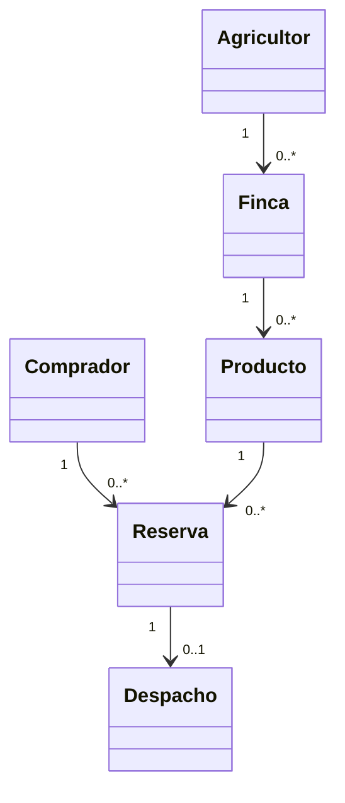

# Modelo inicial y alcance tecnico

El modelo se refinara en cada incremento. El backend separa controlador, servicio, dominio y repositorio; PostgreSQL sera la infraestructura de persistencia cuando se implemente el dominio.

