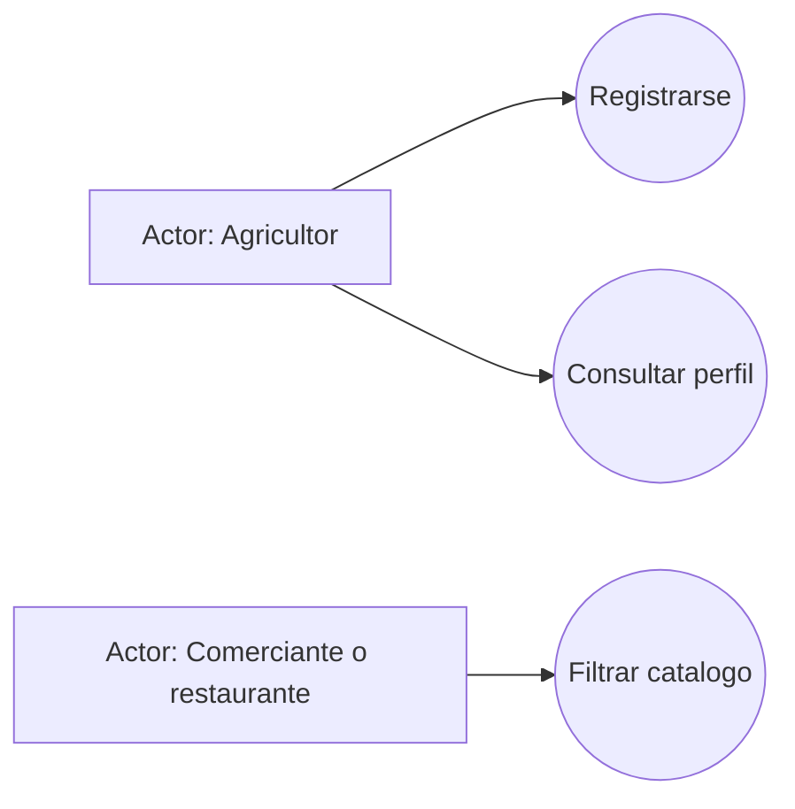
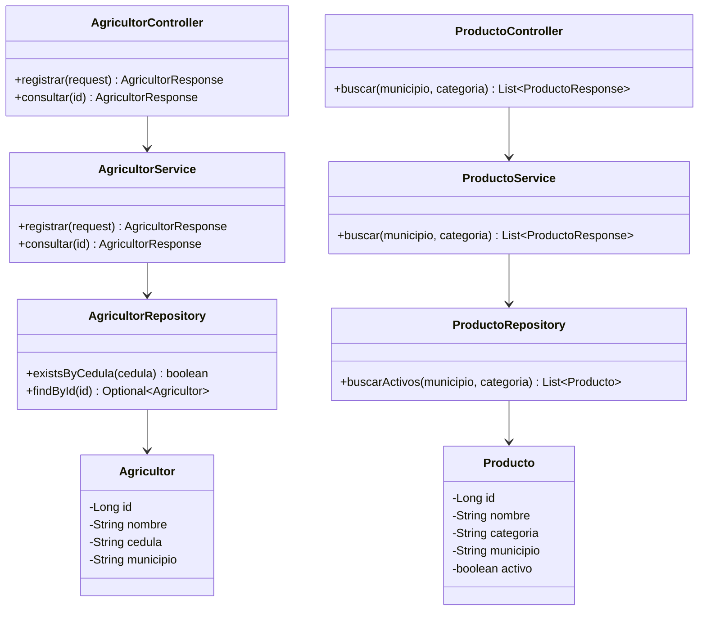
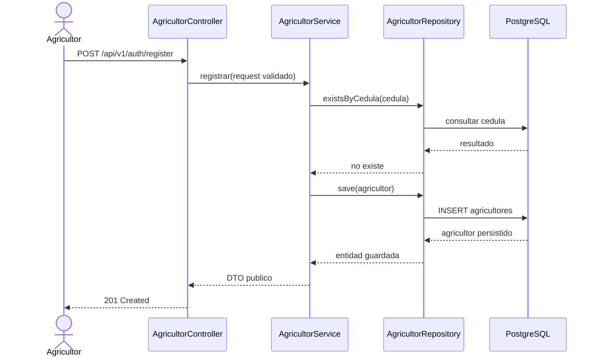
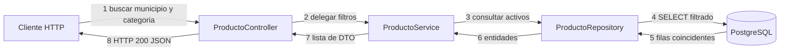
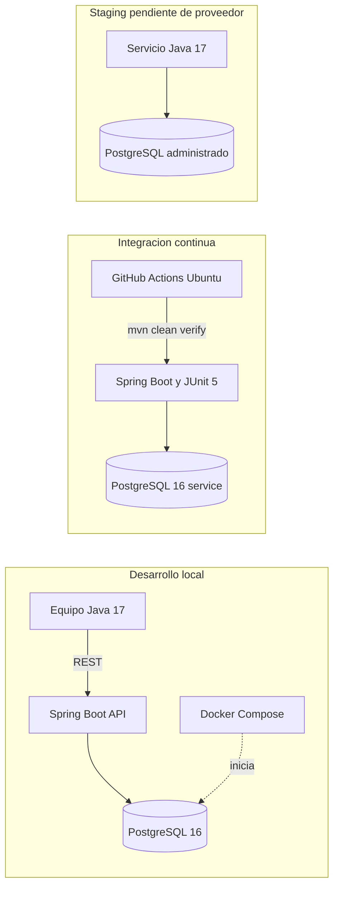

# Modelo UML evolutivo

Estos diagramas describen el incremento actual (registro y consulta de agricultores, filtro de productos) y la infraestructura prevista para el equipo. El alcance del modelo es evolutivo: pedidos, stock, autenticacion JWT, fincas y frontend aun no estan implementados en este incremento.

## Casos de uso

## Actividad: registro de agricultor

## Clases principales

## Secuencia: registro

## Comunicacion: filtro de catalogo

## Despliegue fisico (objetivo del primer corte)

## Patrones y decisiones

- **Repository:** aplicado con Spring Data JPA para aislar el acceso a datos.
- **Singleton:** los servicios y controladores de Spring usan el ciclo de vida singleton por defecto.
- **Factory y Observer:** se reservan para cuando el dominio incorpore tipos diferenciados de pedidos/usuarios y eventos de cambio de estado. No se simulan en este Sprint porque esos flujos no existen todavia.
- La separacion controller-service-repository-domain materializa MVC para la API; la interfaz web y las vistas se desarrollaran en un incremento posterior.

## Pendientes de evolucion

Agregar relaciones de fincas, agricultores y productos; modelar pedidos/stock, estados y notificaciones; y actualizar los diagramas despues de validar esos flujos con el equipo.
