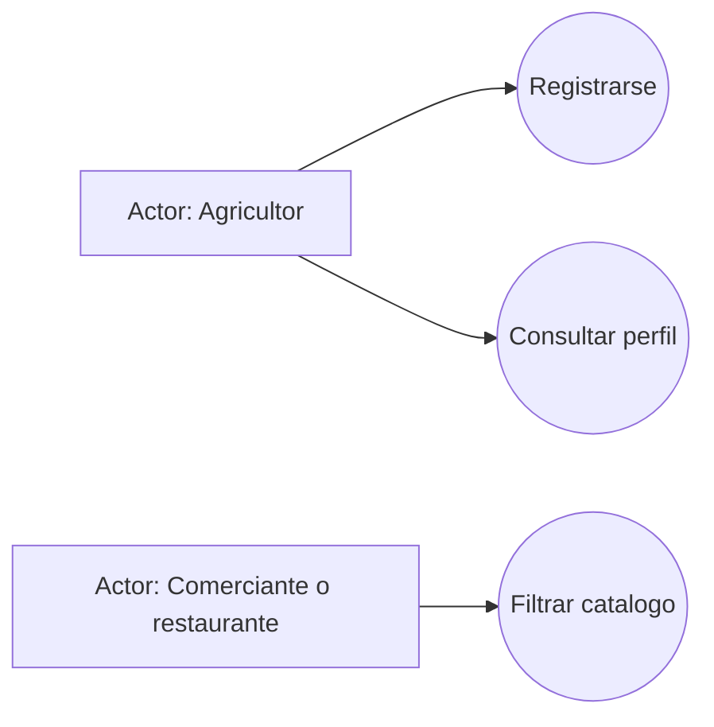
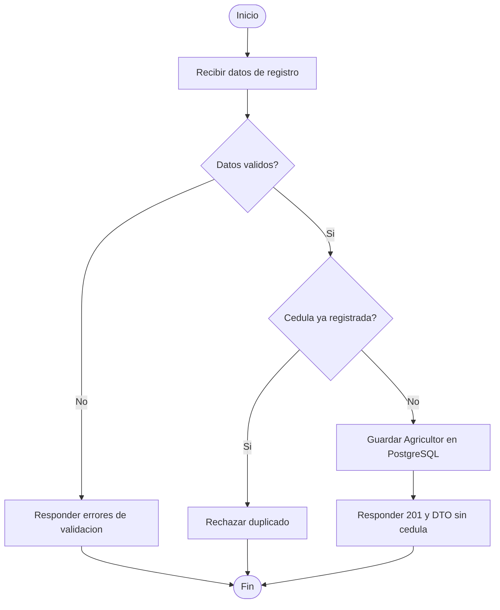
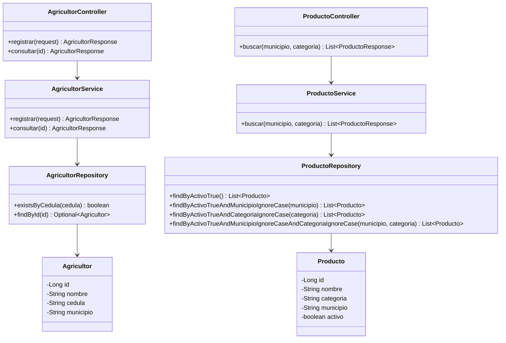
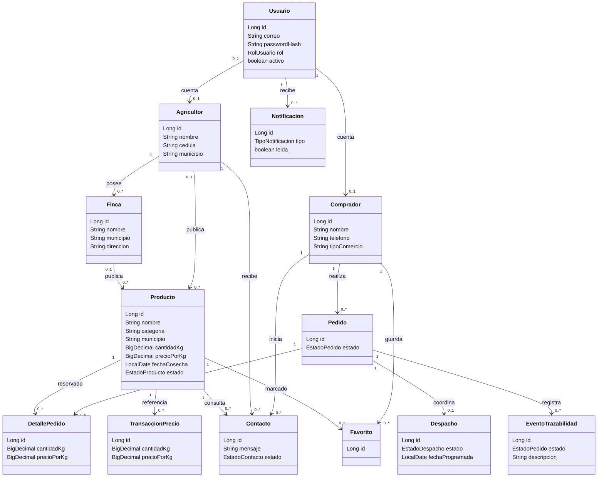
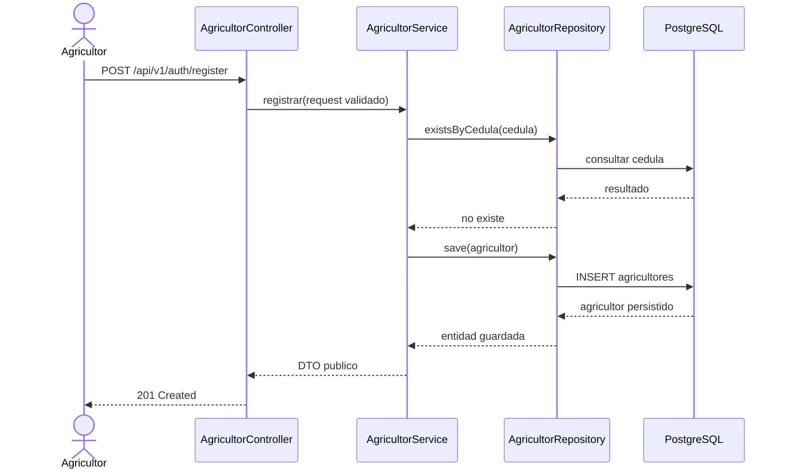
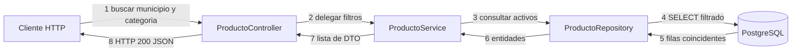
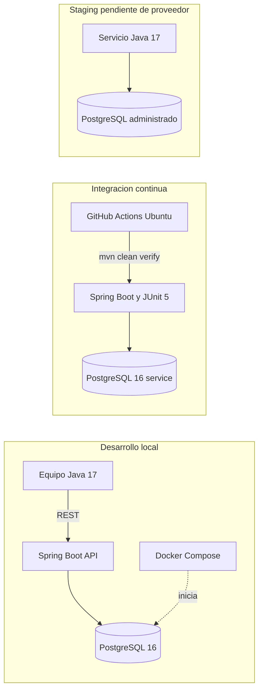

# Modelo UML evolutivo

Estos diagramas describen los endpoints del incremento inicial y el modelo relacional base del proyecto. La fase de arquitectura incluye entidades persistentes para cuentas, compradores, fincas, lotes, pedidos, despachos, trazabilidad, contactos, favoritos, notificaciones y transacciones. Tener una entidad no significa que su caso de uso REST ya este implementado; las funcionalidades se incorporaran progresivamente con sus servicios, validaciones y pruebas.

## Casos de uso

## Actividad: registro de agricultor

## Clases principales

## Modelo de entidades persistentes

El siguiente diagrama representa las entidades JPA incorporadas en la fase de arquitectura. El rol `ADMIN` se conserva en `Usuario`; no se crea una tabla de administradores sin atributos propios. `DetallePedido` captura cantidad y precio por unidad al momento de reservar.

## Secuencia: registro

## Comunicacion: filtro de catalogo

## Despliegue fisico (objetivo del primer corte)

## Patrones y decisiones

- **Repository:** aplicado con Spring Data JPA para aislar el acceso a datos.
- **Singleton:** los servicios y controladores de Spring usan el ciclo de vida singleton por defecto.
- **Factory y Observer:** se reservan para cuando el dominio incorpore tipos diferenciados de pedidos/usuarios y eventos de cambio de estado. No se simulan en este Sprint porque esos flujos no existen todavia.
- La separacion controller-service-repository-domain materializa MVC para la API; la interfaz web y las vistas se desarrollaran en un incremento posterior.

## Pendientes de evolucion

Completar autenticacion/autorizacion y los casos de uso REST de publicacion, precios, contacto, fincas, pedidos y estados. Las entidades de pedidos, trazabilidad, notificaciones, favoritos y transacciones ya tienen migracion y mapeo JPA, pero sus servicios/controladores deben implementarse antes de presentar esos flujos como funcionales. Actualizar los diagramas cuando cambien contratos o reglas del dominio.
