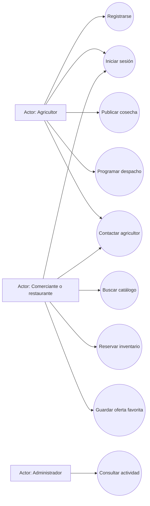
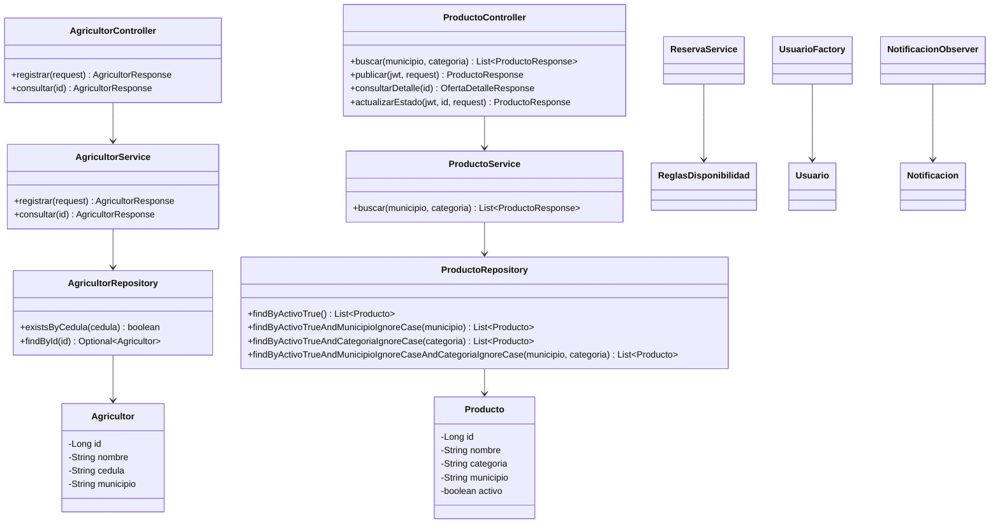
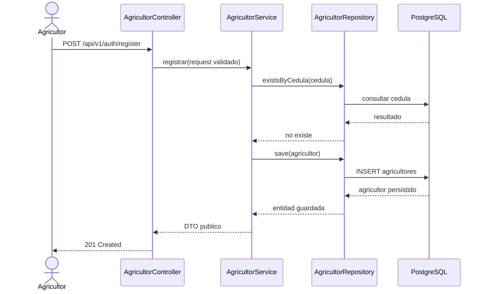
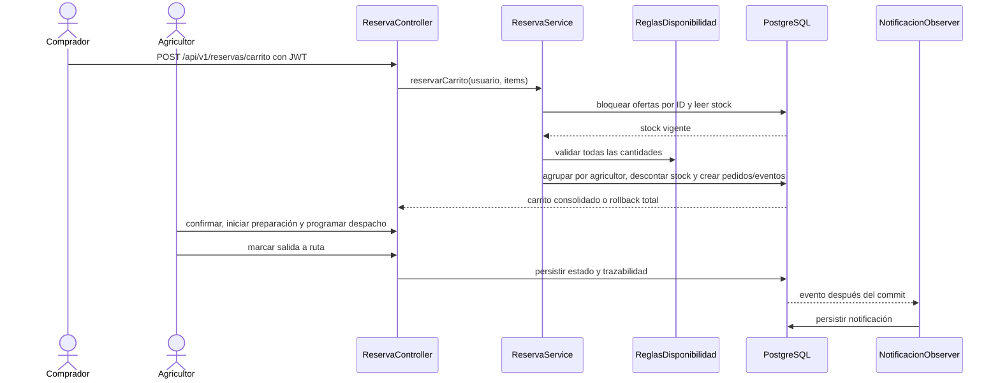
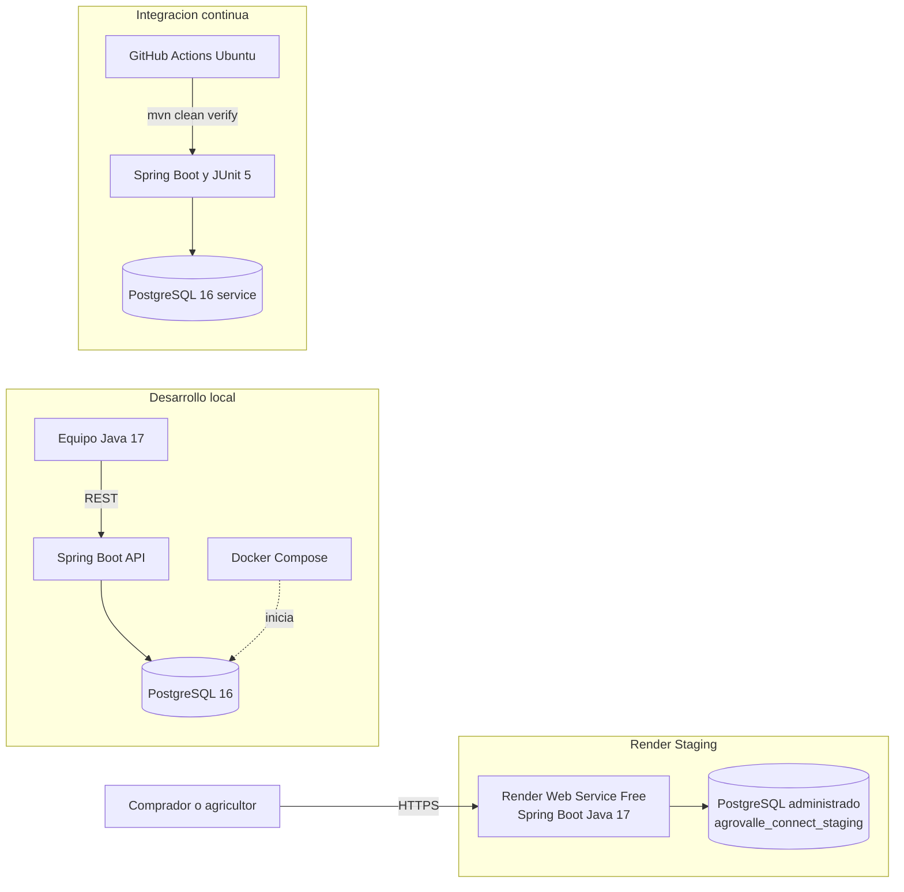

# Modelo UML evolutivo

Estos diagramas describen el backend REST y la interfaz estática servida por Spring Boot. Los flujos representados están conectados con entidades, servicios, repositorios y pruebas de integración. Actualizar los diagramas junto con cambios del código.

## Casos de uso



## Actividad: registro de agricultor


## Clases principales



## Modelo de entidades persistentes

El siguiente diagrama representa las entidades JPA incorporadas en la fase de arquitectura. El rol `ADMIN` se conserva en `Usuario`; no se crea una tabla de administradores sin atributos propios. `DetallePedido` captura cantidad y precio por unidad al momento de reservar.


## Secuencia: registro



## Diagrama de colaboracion (comunicacion UML): HU-04 filtro del catalogo

Los nodos representan objetos participantes y los numeros de los mensajes indican el orden de la interaccion. La respuesta recorre los mismos enlaces en sentido inverso. Este diagrama complementa la secuencia de registro y muestra como colaboran la interfaz, las capas MVC, el repositorio y PostgreSQL para aplicar ambos filtros.

```mermaid
flowchart LR
  comprador["comprador: Usuario"] -->|1. ingresar municipio y categoria| interfaz["interfaz: CatalogoWeb"]
  interfaz -->|2. GET /api/v1/productos?municipio=Dagua&categoria=Frutas| controller["controller: ProductoController"]
  controller -->|3. buscar(municipio, categoria)| service["service: ProductoService"]
  service -->|4. consultar ofertas activas coincidentes| repository["repository: ProductoRepository"]
  repository -->|5. SELECT de ofertas activas y filtros| db[("PostgreSQL")]
  db -->|6. filas coincidentes| repository
  repository -->|7. entidades Producto| service
  service -->|8. lista de ProductoResponse| controller
  controller -->|9. HTTP 200 y JSON| interfaz
  interfaz -->|10. mostrar tarjetas coincidentes| comprador
```

## Secuencia: reserva y despacho



## Despliegue físico actual



La instancia pública de staging es [AgroValle Connect en Render](https://agrovalle-connect-staging.onrender.com/). Al ser un servicio gratuito, puede suspenderse por inactividad; la base de datos gratuita también tiene una fecha de expiración indicada por Render.

## Patrones y decisiones

- **Repository:** repositorios Spring Data JPA aíslan persistencia y consultas.
- **Factory:** `UsuarioFactory` crea cuentas con hash BCrypt y un rol válido.
- **Observer:** `NotificacionObserver` observa eventos transaccionales de contacto y pedido para persistir notificaciones.
- **Singleton:** `ReglasDisponibilidad` es stateless y Spring lo administra como singleton para validar inventario.
- La interfaz demostrativa vive en `src/main/resources/static/index.html` y consume los endpoints REST.

## Pendientes de evolucion

Pendiente de evidencia del equipo: adjuntar fecha, participantes y resultado del Planning Poker si esa sesión ya ocurrió; si no ocurrió, realizarla antes de afirmar que las estimaciones fueron acordadas allí. La existencia de pruebas automatizadas no demuestra por sí sola que se siguió TDD: conservar evidencia real del ciclo Red-Green-Refactor o aplicarlo en los próximos cambios. Cada Pull Request necesita aprobación de un revisor distinto al autor antes de fusionarse. La configuración actual de staging y su enlace se documentan arriba. No registrar ceremonias ni aprobaciones que no hayan ocurrido.
